# 🚀 scomurcio — СКРИПТ, КОТОРЫЙ ДЕЛАЕТ ВСЁ ЗА ТЕБЯ

Создатель Ga1maz(https://ga1maz.ru)

Привет, герой автоматизации!  
Ты держишь в руках 🧙‍♂️ **scomurcio** — волшебный скрипт, который превращает твою Raspberry Pi в готовое к бою устройство практически _без твоего участия_ (ну, почти 😏).

---

## 🧩 Что тебе нужно?

1. Raspberry Pi (любая с GPIO — даже от бабушки).
2. SD-карта (не занятая фотками с отпуска).
3. Wi-Fi или кабель.
4. Терпение на 13 шагов.
5. И, конечно же, этот скрипт.


## 📦 Установка (максимально по-человечески)

### 1. Устанавливаем Ubuntu Server на SD-карту

Скачай Raspberry Pi Imager:  
🔗 https://www.raspberrypi.com/software/

- Выбери Ubuntu Server (например, 25.04 LTS).
- Пройди **13 скринов установки** (будет весело!).
- Установи всё это счастье на SD-карту.
- Вставь SD в Raspberry Pi и включи.

Сейчас подробные картики

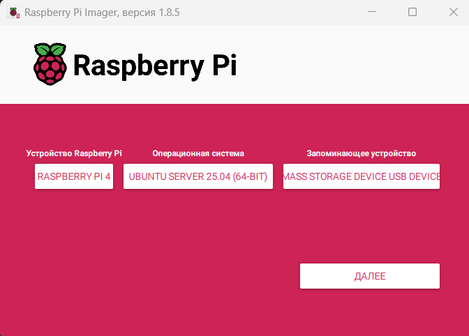  
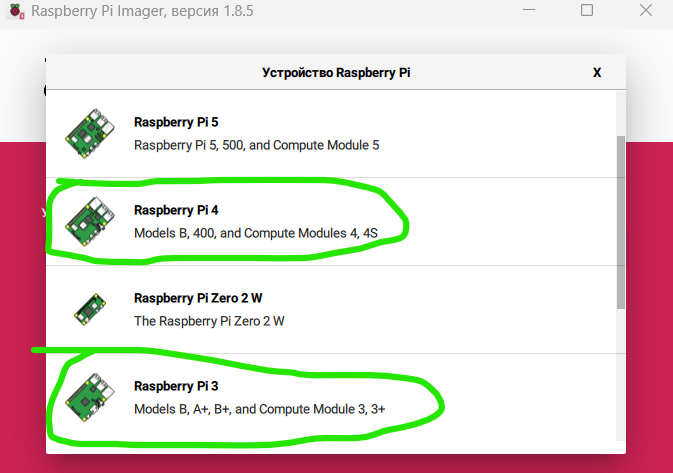
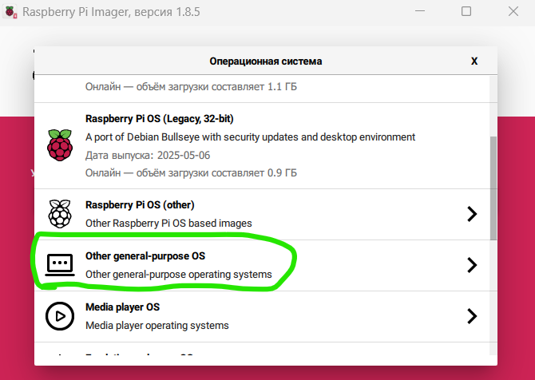  
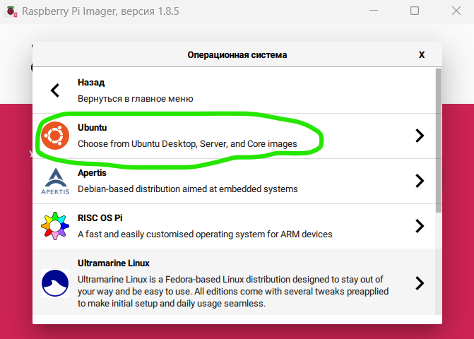  
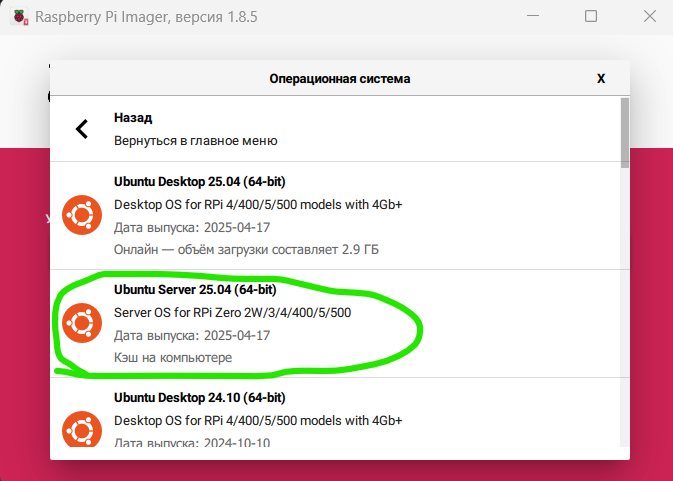  
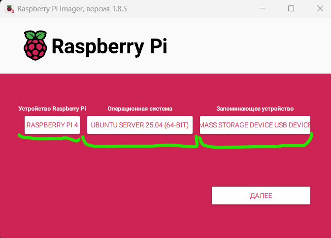  
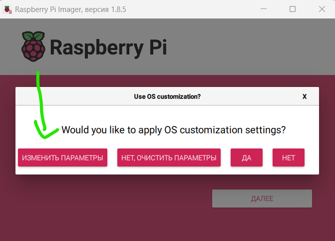  
УСТАНОВИТЕ ЛОГИН И ПАРОЛЬ server server для удобства
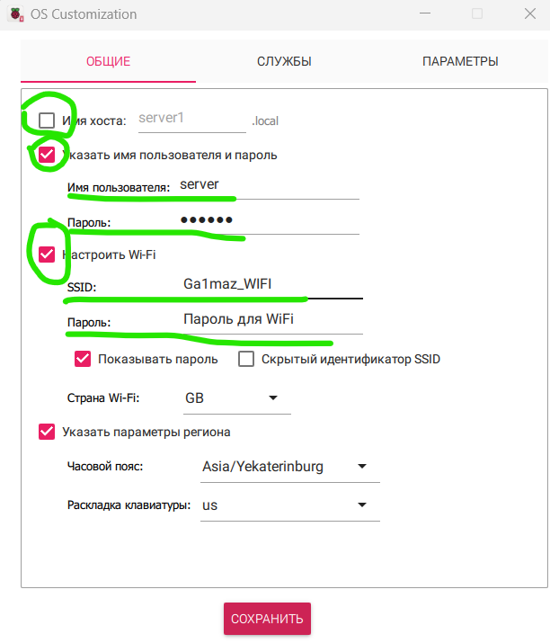  
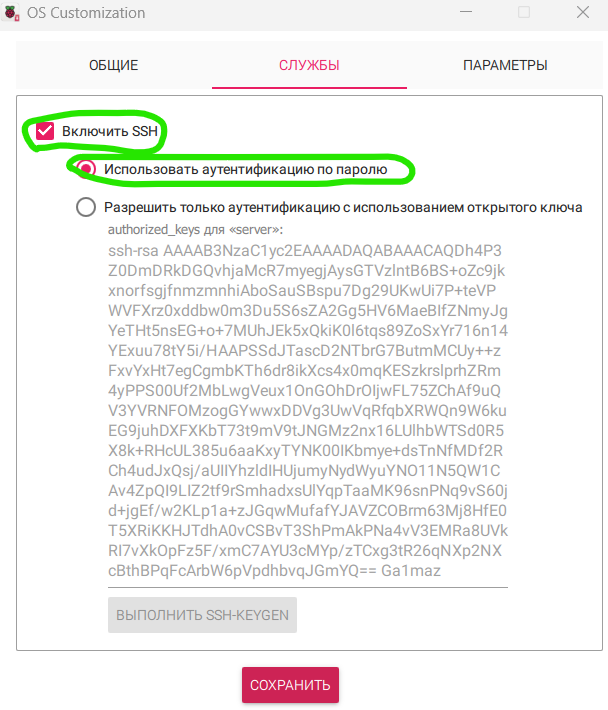
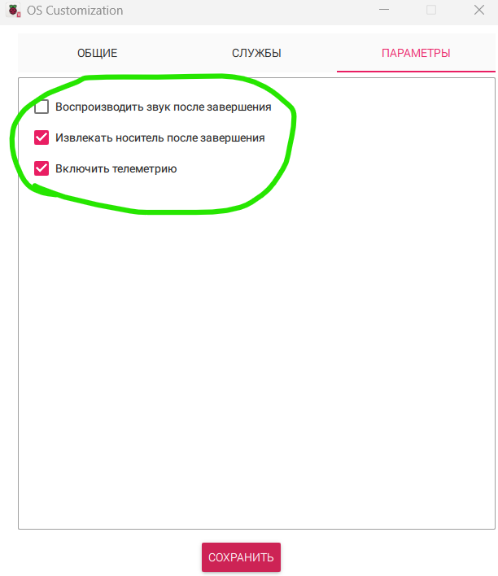  
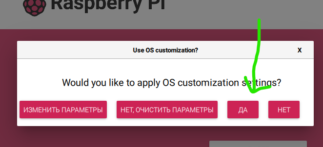  
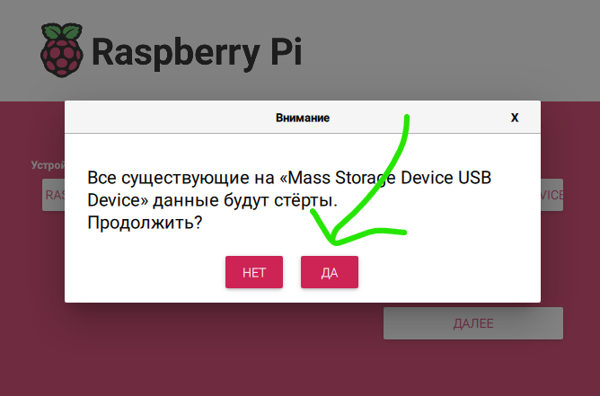  
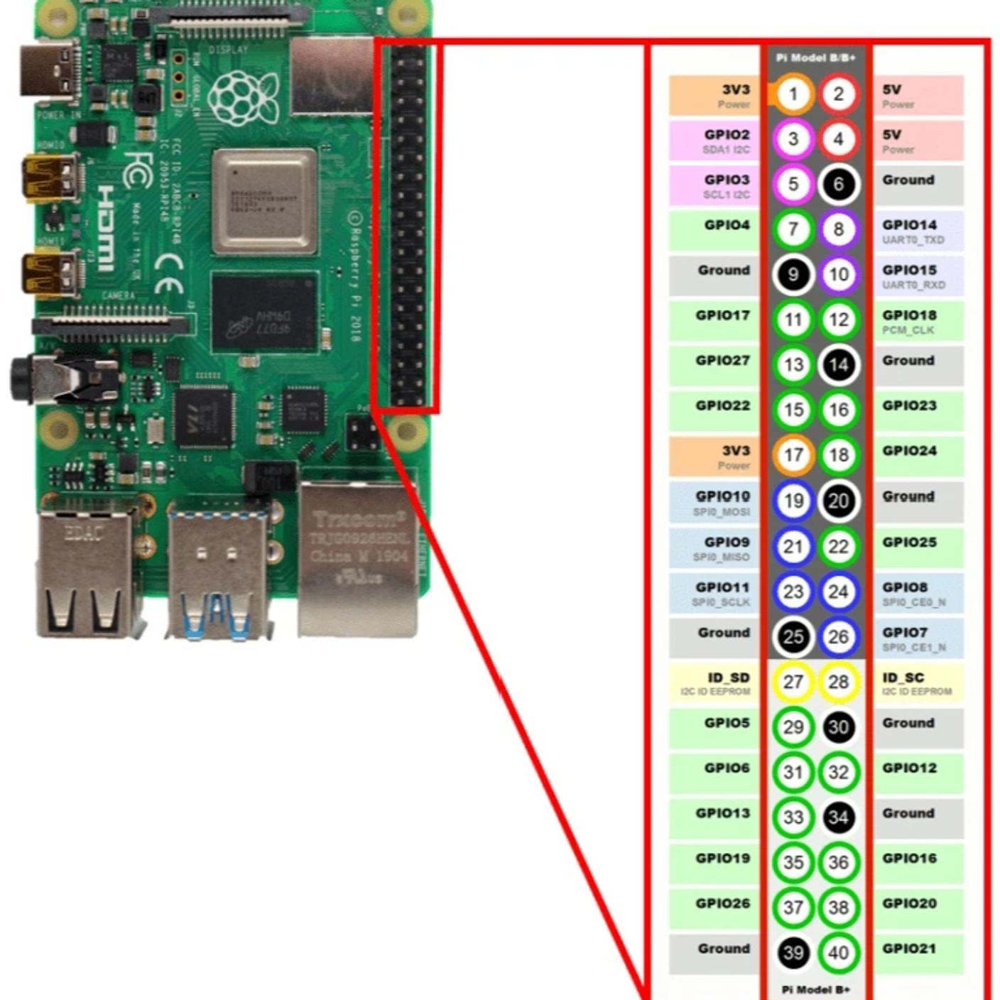  

---

### 2. Подключаемся к Pi

- После загрузки сервера введи лгин и пароль от сервера
  


---

### 3. Устанавливаем curl

```bash
sudo apt update && sudo apt install curl -y
````

---

## ⚙️ Запуск scomurcio

Введи одну команду и откинься:

```bash
bash <(curl https://raw.githubusercontent.com/Ga1maz/scomurcio/refs/heads/main/script.sh)
```


---

## ⚡ Подключение железа

После запуска появится **схема подключения**.
Повтори по ней, всё просто (почти как LEGO).

📷 Пример схемы подключения:


---

## ✅ Подтверждение

Скрипт спросит:

```
Подключено по схеме? (y/n)
```

Нажми `y` — и он всё сделает **сам**.
Поставь чайник. Готово будет раньше, чем ты его заваришь ☕

---

## 🧠 Если что-то пошло не так

1. Проверь питание.
2. Проверь схему.
3. Перезагрузи Pi.
4. Попробуй снова.
5. Напиши мне или коту.

---

## 🎉 Готово!

Ты молодец. scomurcio — работает.
Больше не нужно сидеть в терминале 10 лет.

---

## 🧙 Финал: немного магии ASCII

```
        ( ͡° ͜ʖ ͡°)つ━☆・*。
        ⠀⠀⠀⠀scomurcio установил всё за тебя
        ⠀⠀⠀⠀Ты просто нажал Y
```

---

Made with ❤️, ленью и `curl`
